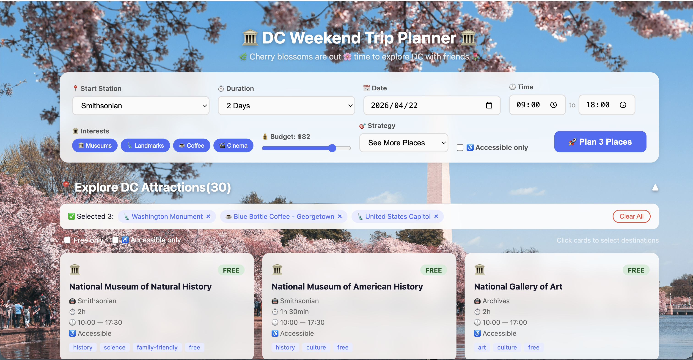

# DC Weekend Trip Planner

A full-stack trip planning application that generates optimized day-by-day itineraries for Washington DC. Give it a starting Metro station, a time window, your interests, and a budget — and it produces a minute-by-minute schedule that respects opening hours, Metro travel time, and entrance fees.



---

## Team

| Name | Role | Responsibilities |
|---|---|---|
| Shawn | Backend | Dijkstra routing, itinerary generation, REST API |
| Xiang | Frontend | React UI, Leaflet map, user interaction |
| Linda | Systems Enhancement | Performance metrics, balanced optimization strategy, budget management |

---

## Architecture Overview

```
┌─────────────────────────────────────┐
│        React + Vite Frontend         │
│  [Trip form, attraction picker,      │
│   Leaflet map, itinerary view]       │
│         localhost:5173               │
└────────────────┬────────────────────┘
                 │ HTTP / JSON
┌────────────────▼────────────────────┐
│         Javalin REST API             │
│           localhost:7070             │
└────────────────┬────────────────────┘
                 │
┌────────────────▼────────────────────┐
│           Service Layer              │
│  TripPlannerService  RouteService    │
│  AttractionService   CostService     │
└────────────────┬────────────────────┘
                 │
┌────────────────▼────────────────────┐
│        Algorithm & Data Layer        │
│  MetroGraph  Dijkstra  JSON files    │
└─────────────────────────────────────┘
```

---

## Tech Stack

| Layer | Technology |
|---|---|
| Language | Java 17, JavaScript |
| Frontend | React 19 + Vite |
| Map | Leaflet + OpenStreetMap |
| REST Server | Javalin 6 |
| JSON Parsing | Jackson |
| Build Tool | Maven |
| Data | Static JSON files |

---

## Getting Started

**Prerequisites:** Java 17+, Maven 3.6+, Node.js 18+

```bash
# Clone the repo
git clone https://github.com/xuanbai01/dc-trip-planner.git
cd dc-trip-planner

# Start the backend
mvn compile
mvn exec:java -Dexec.mainClass="com.dcplanner.Main"
# Backend starts on http://localhost:7070

# In a separate terminal — start the frontend
cd frontend
npm install
npm run dev
# Frontend starts on http://localhost:5173
```

---

## Features

### Backend
- REST API with 7 endpoints
- Metro routing via Dijkstra's algorithm on a weighted directed graph
- Day-by-day itinerary generation with minute-level time blocks
- Three optimization strategies: `minimize_travel_time`, `maximize_attractions`, `balanced`
- Opening hours validation per day of week
- Metro fare calculation based on hop distance
- Cost breakdown: Metro fares + attraction entrance fees
- Attraction filtering by type, budget, and accessibility
- Soft budget warnings instead of hard failures on small overages
- Performance metrics on each response: planning time, total travel minutes, attraction count
- Must-include anchors: guarantee specific attractions appear in the itinerary
- 30 pre-curated DC attractions across 4 categories
- Input validation and centralized error handling

### Frontend
- Trip form: start station, duration, date, time range, interests, budget, strategy
- Collapsible attraction picker with type, free-only, and accessibility filters
- Click to pin specific attractions that must appear in the plan
- Leaflet map with emoji markers, numbered stops, and route polyline
- Day-by-day itinerary cards with time blocks, Metro path, and travel time
- Cost breakdown summary (Metro fares + entrance fees)
- Auto-scroll to results after planning
- Inline error suggestions when filters are too restrictive

---

## Project Structure

```
dc-trip-planner/
├── pom.xml
├── README.md
└── src/
│    ├── main/
│    │   ├── java/com/dcplanner/
│    │   │   ├── Main.java                  # Entry point, server bootstrap
│    │   │   ├── algorithm/                 # MetroGraph, Dijkstra, MetroFareCalculator
│    │   │   ├── controller/                # REST handlers, validation, error handling
│    │   │   ├── factory/                   # AttractionFactory (Factory pattern)
│    │   │   ├── model/                     # POJOs: Attraction, Itinerary, TripRequest
│    │   │   ├── repository/                # JSON file loaders (Repository pattern)
│    │   │   ├── service/                   # Business logic layer
│    │   │   └── strategy/                  # Optimization strategies (Strategy pattern)
│    │   └── resources/data/
│    │       ├── attractions.json           # 30 DC attractions
│    │       ├── metro_stations.json        # 11 Metro stations
│    │       └── metro_edges.json           # Bidirectional travel time graph
│    └── test/
│        └── java/com/dcplanner/
│            ├── algorithm/                 # DijkstraTest, MetroFareCalculatorTest
│            ├── controller/                # TripRequestValidatorTest
│            ├── factory/                   # AttractionFactoryTest
│            └── service/                   # TripPlannerServiceTest
│
└── frontend/
    ├── package.json
    ├── vite.config.js
    └── src/
        ├── App.jsx                        # Root component, state management
        ├── App.css                        # Global styles
        ├── api.js                         # Centralized backend API client
        ├── assets/                        # Static images
        └── components/
            ├── TripForm.jsx               # Trip preferences form
            ├── AttractionPicker.jsx       # Filterable, clickable attraction cards
            ├── MapView.jsx                # Leaflet map with route display
            ├── Itinerary.jsx              # Day-by-day time blocks
            ├── Cost.jsx                   # Cost breakdown
            └── Footer.jsx                 # Credits and links
```

---

## Design Patterns

| Pattern | Where | Purpose |
|---|---|---|
| **Strategy** | `OptimizationStrategy` interface + 3 implementations | Swap the scheduling algorithm without touching the service layer |
| **Factory** | `AttractionFactory` | Validate and normalize attraction data in one place |
| **Repository** | `AttractionRepository`, `MetroRepository` | Isolate JSON file loading from business logic |
| **MVC** | Controllers / Services / Repositories | Separate HTTP handling, business logic, and data access |

The Strategy pattern is the most architecturally significant: adding a fourth scheduling algorithm requires only one new class implementing `OptimizationStrategy` — no changes to `TripPlannerService` or any other class.

---

## Optimization Strategies

The `optimizationStrategy` field in `/trip/plan` selects how each day is built.

### `minimize_travel_time`
Greedy nearest-neighbor. At each step, picks the unvisited attraction with the lowest Metro travel time that still fits in the remaining window. Minimizes time spent in transit at the expense of attraction variety.

### `maximize_attractions`
Greedy by composite score. Each candidate is scored as `typeMatchBonus + durationBonus − travelPenalty`. Favors your preferred attraction types, then shorter-visit venues (to fit more stops in), then nearby stations. Best when you want to pack in as many type-matched venues as possible.

### `balanced` — cluster-first greedy
Plans at the metro-station level rather than one attraction at a time:

1. Groups all candidate attractions by `nearestMetroStation` — each station becomes a cluster.
2. Scores every unvisited cluster as `totalFeasibleValue / (travelTimeToCluster + dwellTimeInCluster)`.
3. Commits to the highest-scoring cluster, visits all feasible attractions there in value-descending order, then moves on to the next cluster.
4. Repeats until no cluster has an attraction that fits the remaining time window.

This produces a natural neighborhood-by-neighborhood feel — do all the Smithsonian museums in one stretch, then move to Capitol Hill — rather than ping-ponging across the city.

### When to pick which

| Goal | Strategy |
|---|---|
| Spend the least time on the Metro | `minimize_travel_time` |
| Hit as many of your preferred venue types as possible | `maximize_attractions` |
| Get a coherent neighborhood-by-neighborhood day | `balanced` |

---

## Backend API Reference

All responses are JSON. All errors return `{"error": "description"}`.

### `GET /health`
```json
{"status": "ok"}
```

### `GET /attractions`
List attractions with optional filters.

| Param | Type | Description |
|---|---|---|
| `type` | string | Comma-separated: `museum`, `landmark`, `coffee_shop`, `cinema` |
| `maxFee` | decimal | Max entrance fee (`0` for free only) |
| `accessible` | boolean | `true` for wheelchair-accessible attractions only |

### `GET /attractions/{id}`
Get a single attraction by ID.

### `GET /metro/stations`
List all Metro station IDs.

### `GET /metro/route?from={id}&to={id}`
Shortest Metro route between two stations.

```json
{
  "stations": ["union_station", "metro_center", "smithsonian"],
  "travelTimeMinutes": 6,
  "fare": 2.25
}
```

### `POST /trip/plan`
Generate a full day-by-day itinerary.

**Request body:**
```json
{
  "startLocation": { "metroStation": "union_station" },
  "tripDuration": "1_day",
  "tripStartDate": "2026-03-29",
  "availableTimePerDay": { "start": "09:00", "end": "18:00" },
  "preferences": {
    "types": ["museum", "landmark"],
    "maxBudget": 30.0,
    "accessibilityRequired": false,
    "optimizationStrategy": "maximize_attractions",
    "mustIncludeAttractionIds": ["national_museum_of_natural_history"]
  }
}
```

| Field | Required | Values |
|---|---|---|
| `startLocation.metroStation` | yes | Any valid station ID |
| `tripDuration` | yes | `half_day`, `1_day`, `2_days` |
| `tripStartDate` | no | `YYYY-MM-DD` — defaults to the next Saturday if omitted |
| `availableTimePerDay.start` | yes | `HH:mm` |
| `availableTimePerDay.end` | yes | `HH:mm` |
| `preferences.types` | no | `museum`, `landmark`, `coffee_shop`, `cinema` |
| `preferences.maxBudget` | no | Decimal USD |
| `preferences.accessibilityRequired` | no | `true` / `false` |
| `preferences.optimizationStrategy` | no | `minimize_travel_time`, `maximize_attractions`, `balanced` |
| `preferences.mustIncludeAttractionIds` | no | List of attraction IDs to guarantee in the itinerary |

### `GET /trip/cost?attractionIds={ids}&startStation={id}`
Estimate cost for an ordered list of attraction IDs.

```json
{
  "metroFare": 5.70,
  "entranceFees": 0.00,
  "totalCost": 5.70,
  "warnings": []
}
```

---

## Metro Stations Reference

| ID | Name | Lines |
|---|---|---|
| `union_station` | Union Station | Red |
| `judiciary_sq` | Judiciary Square | Red |
| `gallery_place` | Gallery Place | Red, Green, Yellow |
| `metro_center` | Metro Center | Red, Blue, Orange, Silver |
| `archives` | Archives | Green, Yellow |
| `l_enfant_plaza` | L'Enfant Plaza | Blue, Orange, Silver, Green, Yellow |
| `smithsonian` | Smithsonian | Blue, Orange, Silver |
| `capitol_south` | Capitol South | Blue, Orange, Silver |
| `eastern_market` | Eastern Market | Blue, Orange, Silver |
| `foggy_bottom` | Foggy Bottom | Blue, Orange, Silver |
| `woodley_park` | Woodley Park | Red |

---

## Running Tests

```bash
mvn test
```

67 tests across 5 suites — all passing:

| Suite | Tests | What it covers |
|---|---|---|
| `DijkstraTest` | 9 | Shortest path correctness, disconnected nodes, same-station edge cases |
| `MetroFareCalculatorTest` | 8 | Fare tier logic across all hop counts |
| `AttractionFactoryTest` | 14 | Validation and normalization of attraction data |
| `TripRequestValidatorTest` | 20 | API input validation, invalid durations, bad time formats |
| `TripPlannerServiceTest` | 16 | End-to-end itinerary generation, budget enforcement, strategy correctness |

---

## Frontend User Flow

1. **Set Preferences** — Select start station, duration, date, time range, interests, budget, and optimization strategy in the top form.
2. **Browse Attractions** — Scrollable attraction cards filtered by selected types. Use the free-only and accessibility toggles to narrow further.
3. **Pin Specific Stops** — Click any attraction card to pin it. Pinned attractions are guaranteed to appear in the generated itinerary. The rest of the day is filled by the chosen strategy.
4. **Plan the Trip** — Click "Auto Plan" (no pins) or "Plan Trip (incl. N picks)" (with pins). The system calls `POST /trip/plan` with all preferences.
5. **View Results** — The picker collapses and the page scrolls to: a route map with numbered markers, day-by-day time blocks, and a cost breakdown.

---

## Known Limitations

- Attraction data is pre-curated and static — no live data or real-time events
- Metro fare uses a simplified hop-distance model, not WMATA's exact pricing
- Opening hours are manually entered and may not reflect holiday schedules
